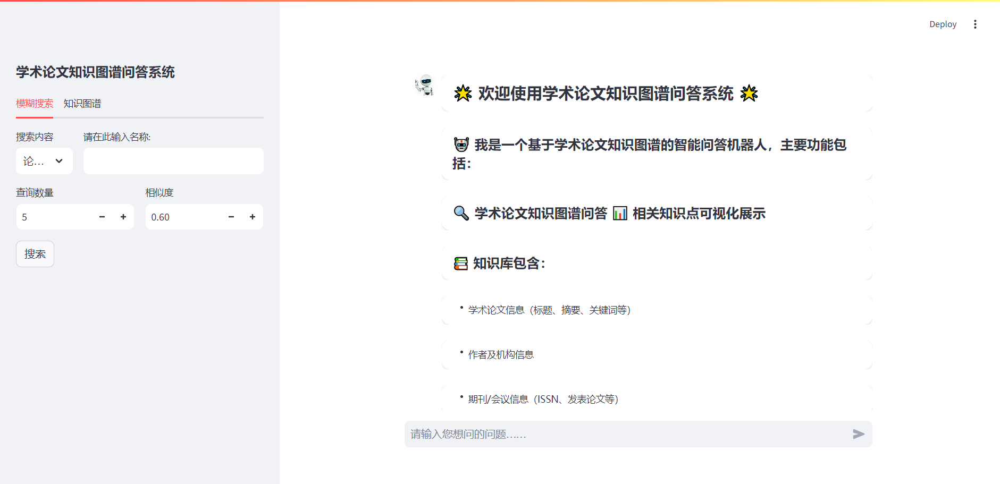
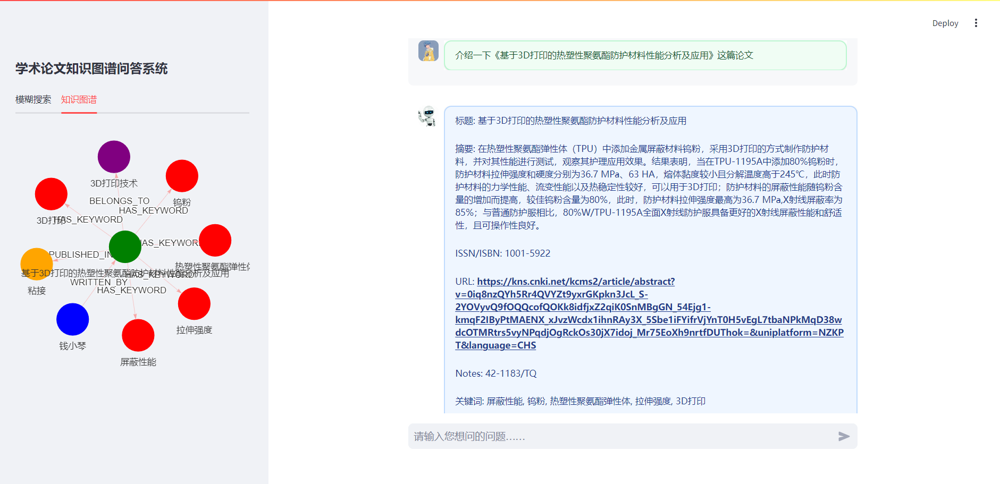
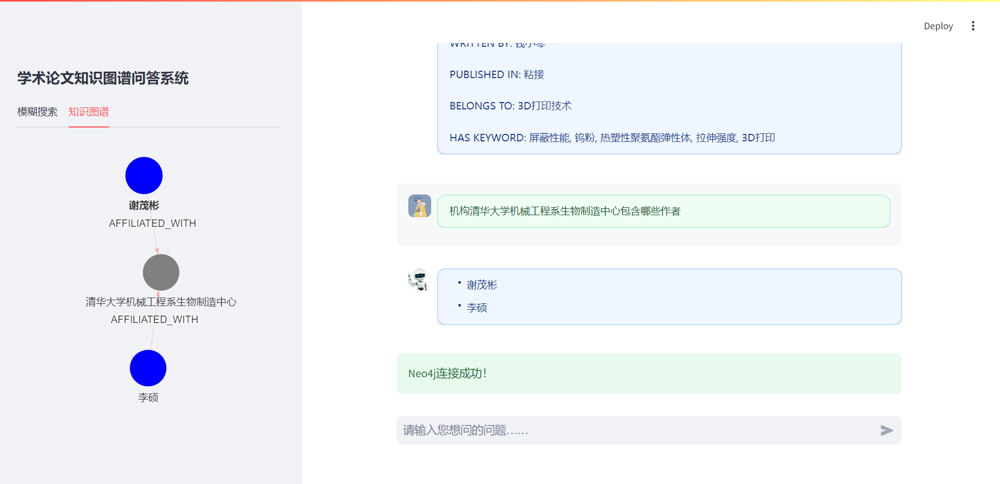
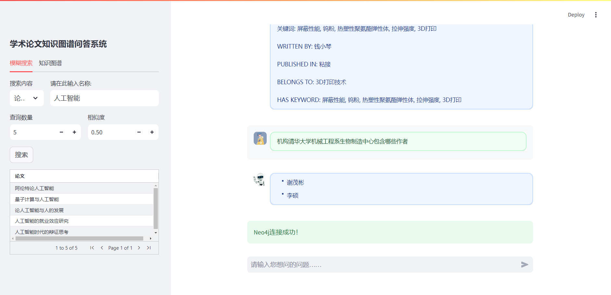
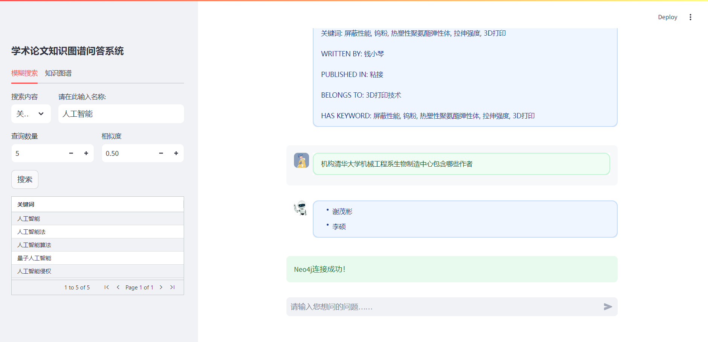

# **基于Sreamlit+Neo4j的中国先进技术知识问答系统**


`ps：本项目是在：https://github.com/hanjunbaba/movie-kg-qa 关于streamlit聊天窗口代码逻辑的基础上进行修改完善的，在此非常感谢原项目创建者的代码分享，对于知识图谱构建和问答系统有所疑问的读者可自行前往查看`

## 项目介绍

这是一个基于有关人工智能、5G技术等九个方面的 “ 中国先进技术 ” 知识图谱的智能问答系统项目，主要功能包括：

1. 从文本数据中抽取实体和关系构建知识图谱

2. 提供自然语言问答接口

3. 使用Neo4j图数据库存储和查询知识图谱数据

4. 提供Streamlit构建的Web界面进行交互

   

## 项目文件夹结构

```c
Streamlit_Neo4j_Question-Answering-System
├── data/                 # 数据文件夹
│   ├── word_dic/         # 实体词典
│   │   ├── all.txt       # 所有实体列表 
│   │   └── ins.txt       # 机构实体列表
│   │   └── ....txt       # 其余实体列表
│   └── get.ipynb         # 数据处理笔记本
├── images/               # 图片资源
├── imgs/                 # 机器人、用户图片存储文件夹
├── answer.py             # 主程序，包含知识图谱构建和问答逻辑
├── chat_ui.py            # Streamlit聊天界面
├── match.py              # 实体匹配模块
├── question.py           # 问题处理模块
├── questions.txt         # 示例问题
└── requirements.txt
```


## 快速开始

### 1.环境配置

Python 3.8.10

Streamlit 1.23.0

Neo4j-community 5.3.0

### 2.安装依赖

```bash
pip install -r requirements.txt
```

### 3. 配置Neo4j连接
修改 <kbd>answer.py</kbd> 中的数据库连接信息：

```bash
# 修改为你的Neo4j连接信息
uri = "bolt://localhost:7687"
username = "neo4j"
password = "your_password"
```

### 4.streamlit启动！

启动运行streamlit页面：

```bash
streamlit run chat_ui.py
```

自动跳转到streamlit提供的本地地址，然后就可以根据<kbd>question.txt</kbd>中的提示问题开始提问了

### 5.补充

鉴于读者数据库结构的不同，在启动之前，首先转到data文件夹下：

```bash
cd data
```

执行<kbd>get.ipynb</kbd>对数据库中的节点数据进行实体记录并生成txt文件

同时具体的节点名称、节点属性和节点关系的修改可见<kbd>question.py</kbd>、<kbd>answer.py</kbd>、<kbd>match.py</kbd>自行修改

初始化streamlit问答系统展示：



问答展示：





模糊搜索展示：



